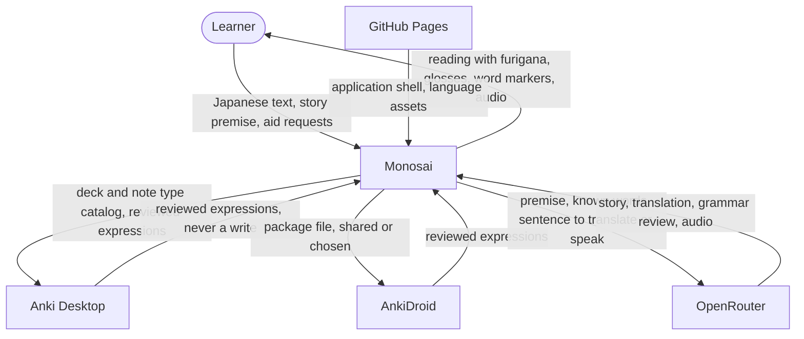

# 3. Context and Scope

Monosai is the only component this repository builds. Everything else named here belongs to somebody
else. The learner owns the Anki collection and the OpenRouter account.

## 3.1 Business Context

| Partner | Monosai receives | Monosai sends |
| --- | --- | --- |
| **Learner** | Japanese text, a story premise, an exception policy, a grammar preset, aid requests | A reading with furigana, glosses, and word markers. Translation, grammar review, and audio on request |
| **GitHub Pages** | The application shell, the tokenizer, and the dictionary assets | Nothing |
| **Anki Desktop** | Decks, note types, and the reviewed expressions in the fields the learner mapped | Read queries only. No card, tag, or schedule ever changes |
| **AnkiDroid** | The same reviewed expressions, through a bridge app or an exported package file | Read queries only |
| **OpenRouter** | A generated story, a translation, a grammar review, an exception verdict, or audio | The premise, the known words, the grammar guidance, and the sentence concerned. Nothing else, and only after a learner act — which the preparation lane may carry out later, but never invents |

### Scope

Inside the scope: text import and segmentation, tokenization, furigana, glosses, vocabulary
marking, one current vocabulary snapshot, story generation with local validation, translation,
grammar review, speech, a library, and offline reading.

Outside the scope: review scheduling, card edits, hosting content, accounts, sync, CSV, EPUB, PDF,
or web page import, and editing a reading after it is saved.

## 3.2 Technical Context

Each partner reaches the code through exactly one adapter, and every adapter lives in
`infrastructure/`. Nothing else in the application talks to a partner directly.
[Chapter 5](05-building-block-view.md) shows the ports these adapters satisfy.

| Partner | Channel and protocol | Adapter area |
| --- | --- | --- |
| Application shell and assets | HTTPS `GET` from the Pages origin, under the application base path | `infrastructure/language/`, for the language assets |
| The AI service, text | HTTPS `POST`, JSON body, bearer key, size and time capped | `infrastructure/openrouter/` |
| The AI service, speech | HTTPS `POST`, audio response, size capped | `infrastructure/openrouter/` |
| The AI service, model catalog | HTTPS `GET`, model list with declared capabilities | `infrastructure/openrouter/` |
| Anki Desktop | HTTP `POST` to AnkiConnect on `127.0.0.1`, actions restricted by an allowlist | `infrastructure/anki/connect/` |
| AnkiDroid bridge | The same AnkiConnect request shape, served by a bridge app | `infrastructure/anki/connect/` |
| Anki package file | A file the learner chooses, read as ZIP plus SQLite in a worker | `infrastructure/anki/package/` |
| Android share sheet | A browser form `POST` caught by the service worker and left in a Cache Storage inbox | `infrastructure/pwa/` |
| Application data | IndexedDB through Dexie | `infrastructure/persistence/` |
| Other browser tabs | A broadcast channel, carrying reading mutations only | `infrastructure/persistence/` |
| Application update | Service worker version events | `infrastructure/pwa/` |

Three properties of this table are load-bearing, and each is a decision rather than an artefact of
the layout:

- **One outbound client for the AI service.** Every request passes through it, and it is the only
  place that reads the credential, checks the host, caps the response size, applies the timeout, and
  decides whether a retry is allowed. See
  [ADR 0018](../decisions/0018-openrouter-request-boundary.md).
- **An AnkiConnect action allowlist with no write action on it.** Read-only access is therefore a
  property of the code, not only a promise. See
  [ADR 0017](../decisions/0017-anki-connect-origin-policy.md).
- **Anki field markup is never trusted as HTML.** It is turned into visible text behind a port, so
  the one place that parses untrusted provider markup stays replaceable and out of the domain.
