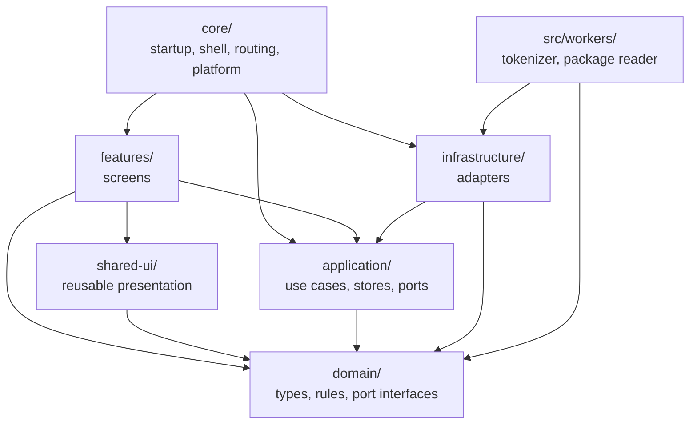
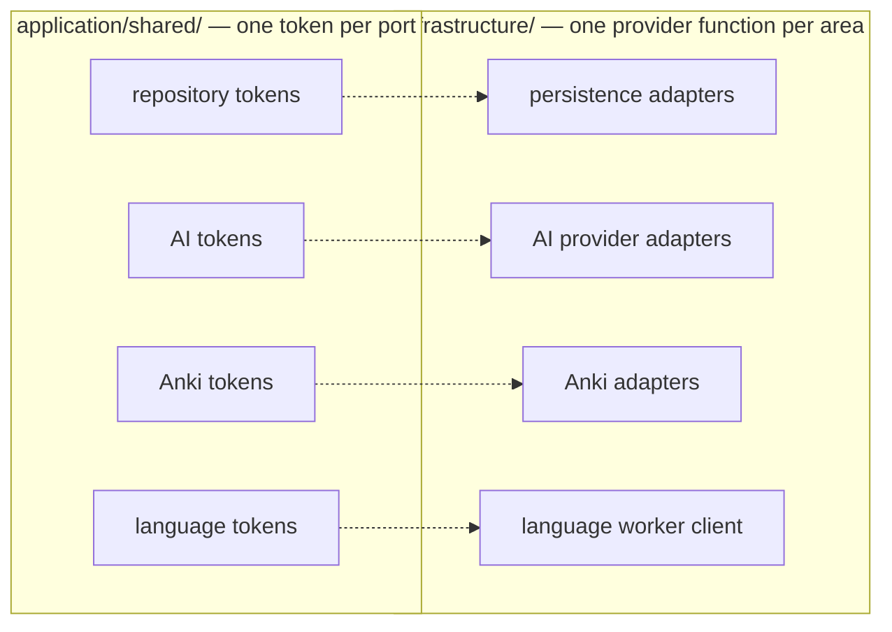
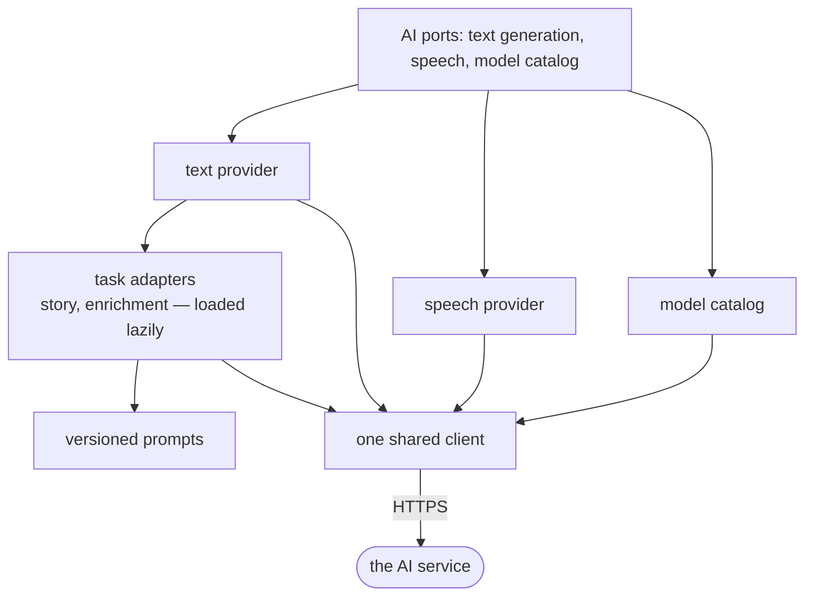

# 5. Building Block View

This chapter names layers and areas, not files. The folder is the stable unit: files move and get
renamed, the layer a concern belongs to does not.

## 5.1 Whitebox: Monosai

### Overview diagram

An arrow means "may import". The linter enforces exactly these arrows, from the `layerZones` list in
[`eslint.config.js`](../../eslint.config.js), which is the authority for them. Any other import fails
the build.

### Motivation for this decomposition

The cut is by layer first, so that the rules a learner's data must obey are stated in one place that
depends on nothing. `domain` holds no framework, no storage, and no network access. It can therefore
be tested as plain functions, and it cannot rot when a library changes.

`application` names what the system can do and declares the ports it needs. `infrastructure`
satisfies those ports. Because the arrow runs from `infrastructure` to `application`, an adapter can
be replaced without any screen knowing. See
[ADR 0003](../decisions/0003-architectural-boundary-enforcement.md).

`core` is deliberately not restricted. It is the composition root: it starts the application, wires
the providers, and owns the shell and the router, so it must be allowed to see every layer.

### Contained building blocks

| Building block | Responsibility | How the rest of the system reaches it |
| --- | --- | --- |
| **`domain/`** | Types, rules, and port interfaces. Knows nothing about the framework, storage, or the network | Exported types and pure functions |
| **`application/`** | Use cases and signal stores. Declares every port as an injection token | Injectable services and stores. The tokens live in `application/shared/` |
| **`infrastructure/`** | Adapters that satisfy the ports: persistence, the AI provider, Anki, language assets, the service worker | One `provide*()` function per area, binding adapters to tokens |
| **`features/`** | One folder per screen, lazily loaded | Route definitions in `core/routing/` |
| **`core/`** | Composition root, ordered startup, application shell, routing, platform services | The application config, which is the only place the layers are wired together |
| **`shared-ui/`** | Presentation components used by more than one screen. Holds no use case | Component selectors |
| **`src/workers/`** | Work that must not block the main thread | A versioned message protocol, validated on both sides |

## 5.2 Level 2: how each layer is divided

Every layer is divided by domain area, and the same area name recurs across layers. `reading`
appears in `domain/`, in `application/`, and as a screen in `features/`; the layer rule decides which
of those may import which. Reading across a row below therefore shows where one concern lives at each
altitude.

| Area | In `domain/` | In `application/` | Adapter area in `infrastructure/` |
| --- | --- | --- | --- |
| **reading** | Readings, paragraphs, sentences, tokens, the paragraph window, token status, the declared preparation targets | Import, open, list, delete, declare targets. Classification against the current snapshot | Persistence |
| **vocabulary** | Snapshots, sources, mappings, deduplication of expressions | Read a source and build one replacement snapshot | Anki, persistence |
| **language** | Tokenizer and runtime interfaces, segmentation, dictionary, kana, the structural baseline | Prepare the tokenizer and the assets, and report readiness | The language worker client and asset loader |
| **ai** | Provider interfaces, tasks, prompt versions, configuration fingerprints, story structure | Run a generation as a job. Test and select models | The AI provider adapters |
| **enrichment** | Translation, grammar, and audio records, cache keys, staleness, the job model, the preparation layers a reading declares | Produce and cache aids, per sentence and in resumable whole-reading jobs | Persistence, the AI provider |
| **audio** | — | Own playback and the platform media session for one reading, including the native resource a continuous reading is played from and grown in | The AI provider, for synthesis |
| **grammar** | Difficulty presets, the profile, the profile hash | Hold the selected preset, register, and optional edited guidance | Persistence |
| **settings** | Settings and credential shapes | Hold configuration that startup loads before routes render | Persistence |
| **storage** | The storage error type, persistence status, maintenance | Report and reclaim space | Persistence |
| **platform** | Application update and shared package inbox ports | Surface an available update, and pick up a shared package | The service worker adapters |
| **shared** | `Result`, typed errors, branded ids, clock, hashing, canonical JSON, locale | The port tokens, the busy registry, the logger interface | Hashing, diagnostics |

Two entries are worth a note. There is no `domain/audio`, because playback is a platform behaviour
rather than a rule about Japanese; what is durable about audio — the clip and its cache key — belongs
to `enrichment`. And `shared` is not a catch-all: it holds only the primitives every other area
needs, and everything in it is either a type or a pure function.

## 5.3 Level 3

Two seams deserve a closer look, because a mistake in either crosses a boundary the rest of the
system relies on.

### Whitebox: the port seam

Every dependency on the outside world passes through an injection token declared in
`application/shared/`. No store, service, or component imports an adapter.

Four properties of this seam are load-bearing, and each is a deliberate choice rather than an
accident of the file layout:

- **Time, identity, and randomness are ports too.** A clock, a hasher, an id generator, and a random
  source all come from the injector. That is what lets a test make a generation run or a cache key
  reproducible.
- **Text generation and speech are separate ports.** Nothing that consumes one can observe the state
  of the other, so a speech failure cannot reach text readiness.
- **Anki providers are built per refresh, not injected as singletons.** A package provider needs the
  file the learner chose, which no injectable factory can supply, so the token supplies a factory
  instead of an instance.
- **Callers never see a worker.** The language port hides both the worker and the asset loader behind
  one runtime interface.

### Whitebox: the outbound AI boundary

| Building block | Responsibility |
| --- | --- |
| **The client** | The only outbound path. Reads the credential, checks the host, caps the response size, applies the timeout, classifies the failure, and decides whether a retry is allowed. It never logs a key or a response body |
| **The port implementations** | Compose a port from a capability tester and its task adapters, so no file carries another's job. Task adapters load lazily, which keeps prompt assets out of the initial bundle for a learner who only imports their own text |
| **The task adapters** | Turn a domain request into a provider request, and validate the reply before returning it |
| **The prompts** | Assembled from immutable layers, with a version per task. Changing a version invalidates the cached results that used it |
| **The model catalog** | Reads the capabilities a model declares, which a probe then confirms. See [ADR 0040](../decisions/0040-speech-capabilities-are-declared.md) |

This is one client rather than one per task because of
[ADR 0018](../decisions/0018-openrouter-request-boundary.md): the credential boundary, the retry
limits, and the error model are single concerns, and duplicating them is how one of them drifts.
