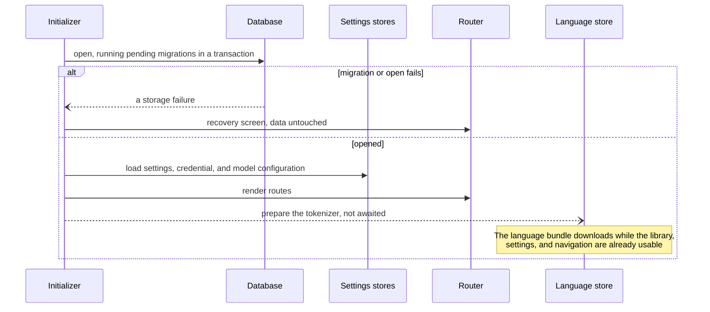
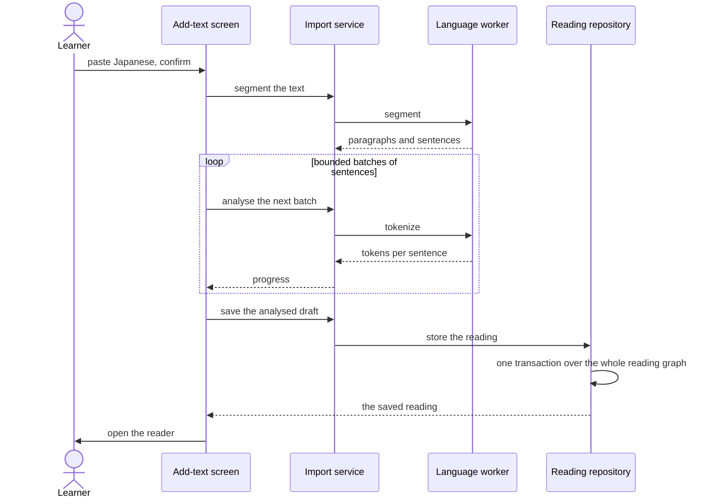
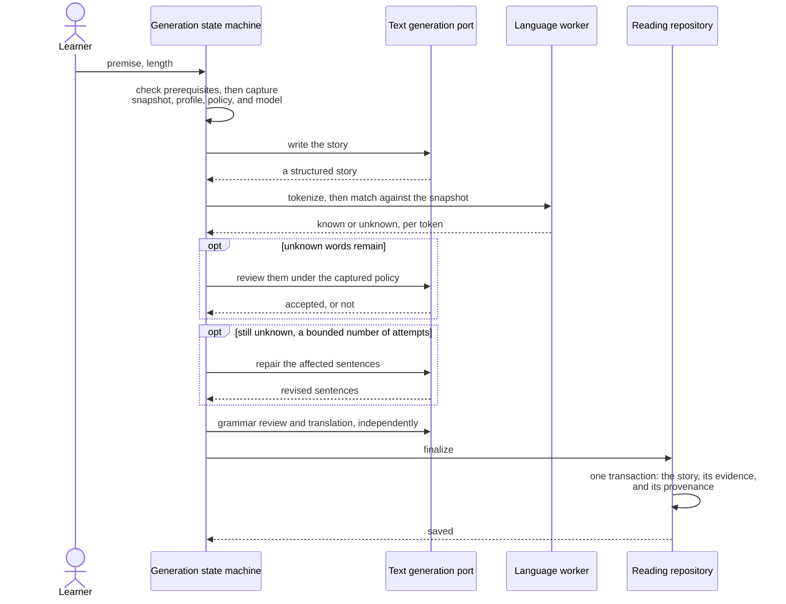
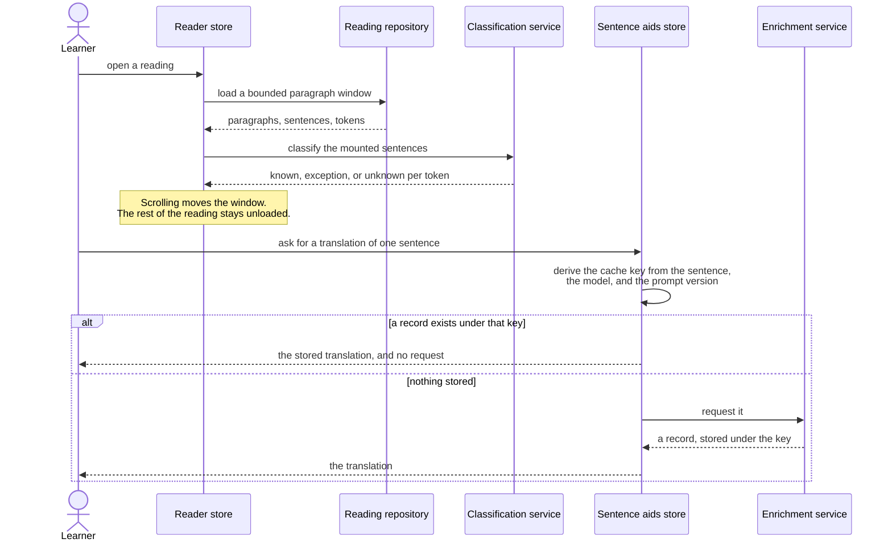

# 6. Runtime View

Four scenarios. Each was chosen because it crosses a boundary that
[chapter 5](05-building-block-view.md) draws: startup crosses into storage, import crosses into a
worker, generation crosses into a provider, and reading crosses into both. The participants are
building blocks, named by their role rather than by their file.

## 6.1 Startup

Startup is ordered and it can fail. Navigation renders only after every step succeeds. A failure
routes to a recovery screen. It never deletes data and never reloads by itself.

The step list is data rather than control flow, so the order is stated in one place and a step can
be added without touching the runner. Model configuration is loaded before routes render, so a
route cannot overwrite a selection that was written while the learner was navigating.

## 6.2 Import a text

Two properties matter here. Analysis runs in bounded batches, so a very long import reports progress
and stays cancellable. The whole graph is written in one transaction, so a reading is never visible
without its text and its tokens.

## 6.3 Generate a story

A generation is a job, not a screen. A root-provided registry owns the runs, and each job gets its
own instance of the generation state machine in its own injector. The machine below therefore still
governs exactly one run, while several run side by side
([ADR 0044](../decisions/0044-backgrounded-story-generation.md)). The learner can start a story and
go and read something else; the library lists each unsaved run as a muted row naming its stage.

Every input is captured before the first request, so changing a setting during a run cannot change
what the running story is judged against.

Everything before the final step is discardable. A cancellation or a failure at any earlier stage
leaves no row behind. Finalizing is the one stage that cannot be cancelled, because it is a single
transaction that writes the whole story or writes nothing.

A word that repair could not replace does not throw the story away. It is saved and marked in the
reader ([ADR 0033](../decisions/0033-unresolved-unknown-words-are-marked-not-rejected.md)). Only a
structural failure ends in the invalid-draft state, which lives in the store and dies with it.

A job is not persisted, and it belongs to the tab that started it. An open provider request cannot be
resumed, and nothing is written before the final transaction, so a reload ends every run. The
application warns before a reload it can see.

## 6.4 Read a reading, and ask for an aid

Nothing on this path starts by itself. The reader shows a reading with no aid until the learner asks
for one, which is how quality goal 3 is met at runtime.

The cache key is a fingerprint of everything that could change the answer, which
[chapter 8](08-crosscutting-concepts.md) describes. Change the voice and the old clips are hidden
rather than played, and the screens say so
([ADR 0043](../decisions/0043-voice-changes-hide-clips-and-say-so.md)).
