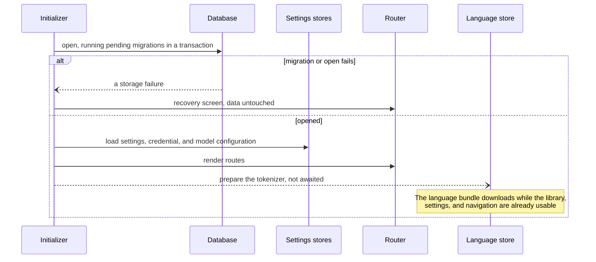
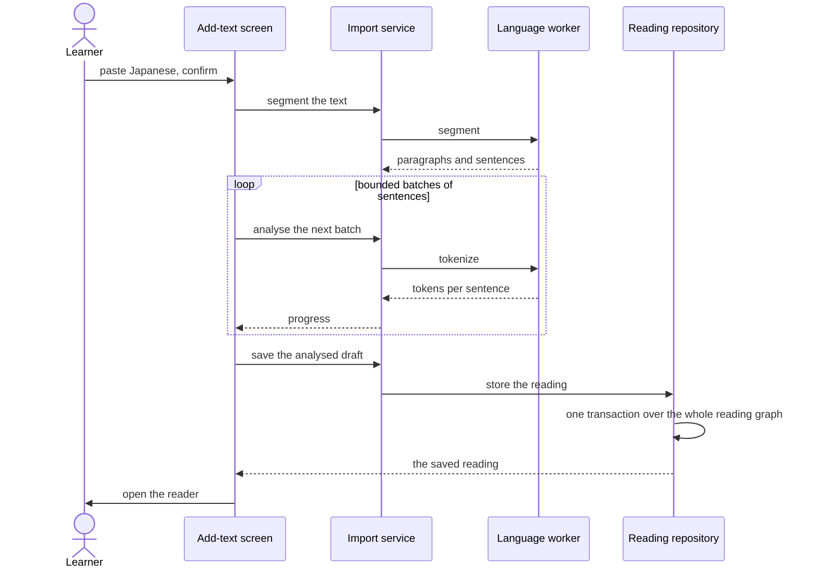
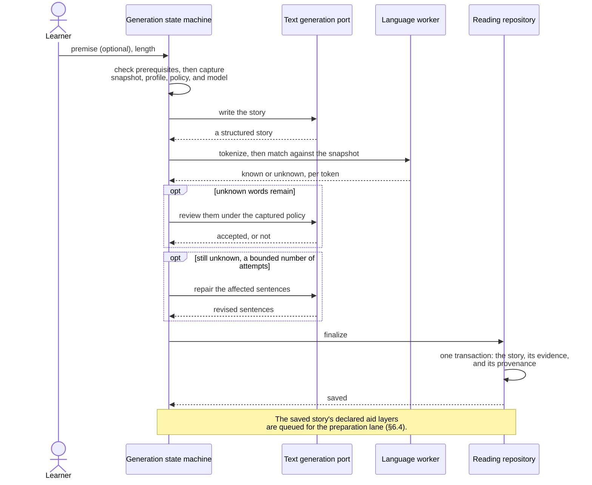
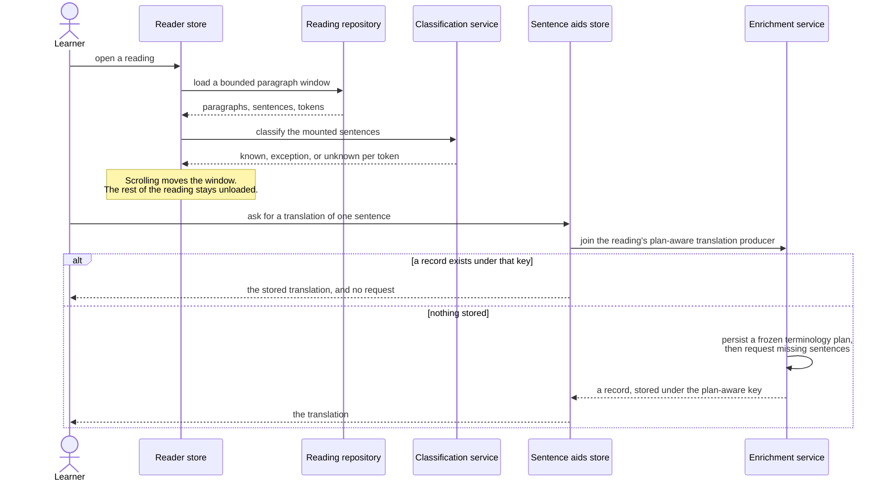
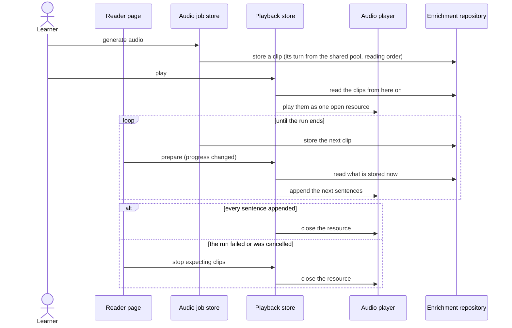
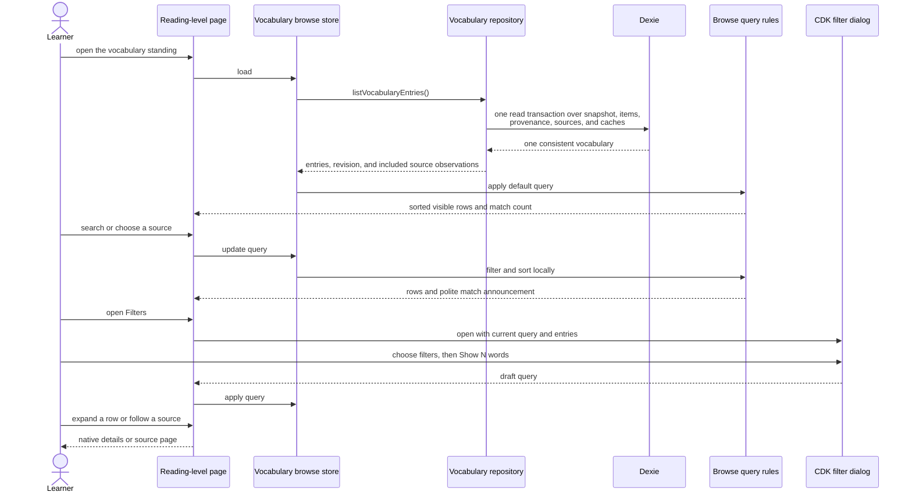

# 6. Runtime View

Four scenarios. Each was chosen because it crosses a boundary that
[chapter 5](05-building-block-view.md) draws: startup crosses into storage, import crosses into a
worker, generation crosses into a provider, and reading crosses into both. The participants are
building blocks, named by their role rather than by their file.

## 6.1 Startup

Startup is ordered and it can fail. Navigation renders only after every step succeeds. A failure
routes to a recovery screen. It never deletes data and never reloads by itself.



The step list is data rather than control flow, so the order is stated in one place and a step can
be added without touching the runner. Model configuration is loaded before routes render, so a
route cannot overwrite a selection that was written while the learner was navigating.

## 6.2 Import a text

Connecting desktop Anki discovers its catalogue and reads bounded field samples.
A Japanese mapping is suggested or the learner chooses it explicitly. Extraction
and analysis prepare a preview without writing a source or changing the active
vocabulary. Confirmation atomically stores the source, its cache, and the combined
snapshot; cancellation or navigation discards the draft. See
[ADR 0055](../decisions/0055-anki-mapping-is-suggested-then-confirmed.md).



Two properties matter here. Analysis runs in bounded batches, so a very long import reports progress
and stays cancellable. The whole graph is written in one transaction, so a reading is never visible
without its text and its tokens.

## 6.3 Generate a story

A generation is a job, not a screen. A root-provided registry owns the runs, and each job gets its
own instance of the generation state machine in its own injector. The machine below therefore still
governs exactly one run, while several run side by side
([ADR 0044](../decisions/0044-backgrounded-story-generation.md)). The learner can start a story and
go and read something else; the library lists each unsaved run as a muted row naming its stage.

Every input is captured before the first request, so changing a setting during a run cannot change
what the running story is judged against. This includes vocabulary strictness: relaxed spends no
content repair, standard spends at most one, and strict spends at most two.



A premise is optional. An empty one is a request rather than an omission: the story prompt says in
its own voice that no premise was supplied and that the model chooses the situation, because an
empty premise block would arrive as a premise that says nothing. Only the character limits are
validated before anything is spent.

Generation writes Japanese and stops. The aid layers the story declares are produced afterwards by
the preparation lane described in [§6.4](#the-preparation-lane), so a story reaches the library as
soon as its own text is valid rather than after two batched provider stages. The story carries the
targets chosen for it, and provenance records those targets as they stood at generation time — the
reading's own declaration is the mutable one
([ADR 0047](../decisions/0047-a-reading-declares-what-it-should-have.md)).

Everything before the final step is discardable. A cancellation or a failure at any earlier stage
leaves no row behind. Finalizing is the one stage that cannot be cancelled, because it is a single
transaction that writes the whole story or writes nothing.

A word that repair could not replace does not throw the story away. It is saved and marked in the
reader ([ADR 0033](../decisions/0033-unresolved-unknown-words-are-marked-not-rejected.md)). Story
length is guidance to the writer rather than a local acceptance rule, while malformed structured
replies are refused at the provider boundary
([ADR 0046](../decisions/0046-length-is-a-guideline.md)).

A job is not persisted, and it belongs to the tab that started it. An open provider request cannot be
resumed, and nothing is written before the final transaction, so a reload ends every run. The
application warns before a reload it can see.

## 6.4 Read a reading, and ask for an aid



Nothing on this path starts by itself. The reader shows a reading with no aid until the learner asks
for one, or until the preparation lane fills in a layer the reading declares, which is how quality
goal 3 is met at runtime.

A learner can also ask to analyse a whole reading. That explicit action creates an
`analyze-reading` job. The job captures the text-model configuration and immutable grammar profile
once, includes the profile hash in its configuration fingerprint, and plans contiguous adaptive
batches of at most 30 sentences and 12,000 estimated input tokens. Grammar is selective — at most
one useful finding per sentence — so an ordinary short story fits one request. Long readings run
three independent batches at a time. The provider adapter allows 4,096 response tokens and one
bounded format recovery; it treats an empty findings array as a valid review. Each successful
analysis is stored before its job item advances. A failed batch is recorded without discarding
successful siblings; the job itself adds no retries beyond the provider client's bounded transport
and format-recovery rules. After a reload, only a matching unfinished job resumes. A configuration
mismatch closes the old job and starts work under the new fingerprint, while cancellation keeps
every analysis already stored.

Whole-reading translation reports that it has stopped only after cancellation is saved. Reloading
after that report cannot resume the cancelled job; a failed cancellation write is shown as a storage
failure instead.

Translation captures the configured model and prompt, title, premise, register, ordered source
identity, and a deterministic whole-reading candidate set before its first request. Proper nouns
and useful recurring terms come from stored token analyses; no grammar result or extra AI request
is needed. A small opening (normally three sentences, or a three-to-five-sentence first paragraph)
returns both per-sentence English and an optional glossary. A valid glossary is frozen with the
accepted opening rows in one transaction before any tail request starts. If only the glossary is
invalid, the English is stored provisionally and Retry repairs only the glossary. Later requests
use stable Japanese passage windows, identical captured story context, and the identical frozen
glossary. At most three translation requests roll concurrently; each also holds a shared permit.

The reader combines appearance preferences, per-layer content status, and maintenance in Story
options. Explicit preparation and retry actions use the existing layer producers; stopping a layer
also closes its queued work and removes that layer's standing target without deleting saved aids.
Queued work, the first outstanding grammar request, completed sentence counts, provider failures,
storage failures, and Stop, Continue, and Retry actions are reported in the affected Story options
row. The row is an accessible live status; closing the panel never cancels work. Only Listen and
Story options remain beside the title. Each persisted aid can be cleared independently after an
explicit confirmation; the maintenance transaction removes that aid's rows and resumable job while
preserving the reading and its other aids. Generation retains its target switches.

The reading surface leaves native touch selection and copying to the browser. A touch tap on a word
opens it at once; a second tap in the same sentence within the gesture window replaces it with
sentence details, and mouse and keyboard activation remain immediate. The visible Sentence route
below a word's form summary is the equivalent keyboard and touch path. On a small viewport,
word and sentence details are independently scrollable sheets whose bottom edge is the measured
docked-player boundary. Their height uses the smaller of the viewport cap and the remaining space
above that boundary, and the page remeasures when the player or viewport changes
([ADR 0053](../decisions/0053-reader-touch-details-and-measured-sheets.md)).

The cache key is a fingerprint of everything that could change the answer, which
[chapter 8](08-crosscutting-concepts.md) describes. Change the voice and the old clips are hidden
rather than played, and the screens say so
([ADR 0043](../decisions/0043-voice-changes-hide-clips-and-say-so.md)).

### The preparation lane

A reading declares the aid layers it should eventually contain
([ADR 0047](../decisions/0047-a-reading-declares-what-it-should-have.md)). Four moments, and only
four, turn that declaration into work: a layer is switched on, a generated story is saved with the
layers chosen for it, a reader is opened, and an explicit *Prepare*, *Retry*, or *Prepare again*.
Each queues a job row covering the sentences that have never been given that layer under **any**
configuration, so changing the model queues nothing.

```mermaid
sequenceDiagram
    participant Moment as One of the four moments
    participant Lane as Preparation lane
    participant Rows as Job rows
    participant Runner as Layer producer
    participant Pacer as Preparation pacer

    Moment->>Lane: reconcile this reading
    Lane->>Rows: queue the declared layers it has never had
    loop while rows are outstanding
        Lane->>Rows: claim this reading, with a heartbeat
        alt another lane holds it
            Rows-->>Lane: conflict
            Note over Lane: skip this reading; work another
        else claimed
            Lane->>Runner: start English, grammar and audio together
            Runner->>Pacer: ask for a turn at this sentence's position
            Pacer-->>Runner: a permit, lowest position first
            Runner->>Rows: store each result, then record it
        end
    end
    Note over Lane: A generation, an update, or a lost<br/>connection parks the run at a batch<br/>boundary. It never cancels one.
```

The lane runs one reading at a time, the open one first. All three layers start together, and every
request they want to make takes its turn from one shared `PreparationPacer`: at most ten in flight
across the three layers, granted to the lowest waiting `(sentence position, layer)`. The reading
therefore fills front to back — sentence 1's English, grammar and clip before sentence 60's English —
rather than one whole layer at a time
([ADR 0059](../decisions/0059-preparation-fills-the-reading-in-order.md)). Translation runs its small
opening alone and persists its frozen plan before any tail request asks. The lane never
registers as busy: an update
activates while a queue exists, and the rows are picked back up after the reload
([ADR 0048](../decisions/0048-the-preparation-lane-yields.md)).

## 6.5 Hear a reading that is still being generated

Audio arrives one sentence at a time, and a reading can be started as soon as the sentence being
started from has a clip ([ADR 0034](../decisions/0034-progressive-four-way-audio.md)). Continuous
playback then builds **one native media resource** over the sentences that exist and leaves it open,
so each new clip is appended to the resource the element is already playing rather than replacing its
source ([ADR 0045](../decisions/0045-a-reading-is-extended-while-it-is-generated.md)).



The appends are what let the reading carry on with the screen locked: the element stays audible
across every sentence boundary, so the document keeps the media-playing reason not to be frozen and
the advance happens inside the native pipeline rather than in an event handler. Playback learns of a
new clip from its own read of what is stored — it never watches the generation job
([ADR 0037](../decisions/0037-audio-transport-recovery-and-one-track.md)).

Reaching the frontier is a stall inside the resource, reported as `waiting` and named by sentence.
It ends when the next clip is appended. It is the one gap left: a stall long enough for the page to
be frozen still stops the reading, which is why the shared concurrency bound — and the position
ordering that fills the front of the reading first — exists.

## 6.6 Browse vocabulary

The vocabulary standing on the reading-level page is the entry point to the
browser. The page reads the active snapshot, item rows, provenance, and source
observations in one repository transaction. Search, source, difficulty, date,
and sort are then applied locally by pure domain rules; opening the filter
sheet does not contact Anki or change stored data. Expanding a row reveals the
reading, full first-studied date, and source links from that same capture.



An empty result caused by search or filters leaves the controls in place and
offers Reset. A missing or failed repository read is reported with retry; it
never replaces the learner's stored vocabulary.
