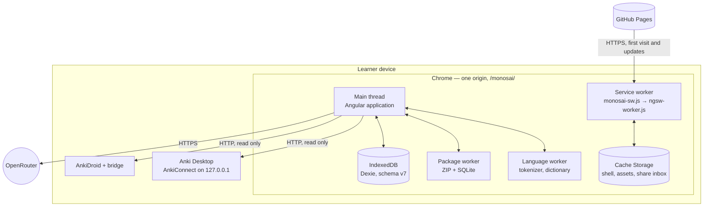
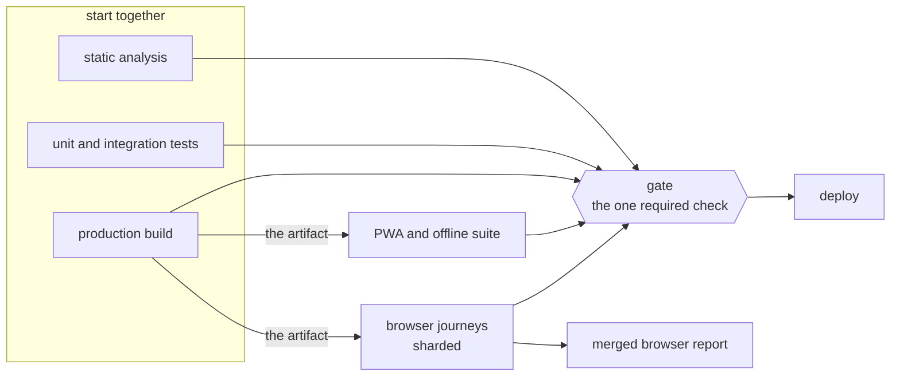

# 7. Deployment View

## 7.1 Infrastructure Level 1

There is one production environment. It is a static site on GitHub Pages, plus whatever the learner
already runs on their own machine.

| Infrastructure element | Building blocks it runs | Why here |
| --- | --- | --- |
| **Main thread** | `core/`, `features/`, `application/`, most of `infrastructure/` | The user interface and every use case |
| **Language worker** | `src/workers/language/` | The tokenizer is WebAssembly and the dictionary index is large. Neither may block the reader. See [ADR 0005](../decisions/0005-tokenizer-selection.md) |
| **Package worker** | `src/workers/package/` | Reading a package means unzipping and then querying SQLite. Both are slow, and both handle untrusted input. See [ADR 0016](../decisions/0016-anki-package-parsing.md) |
| **Service worker** | Monosai's own worker, wrapping the framework's | Offline shell, asset caching, and the Android share target. Monosai's worker handles the share `POST` and hands everything else to the framework's worker unchanged. See [ADR 0036](../decisions/0036-android-package-share-target.md) |
| **IndexedDB** | Every Dexie repository | All learner data. Survives a reload and a reinstall of the shell |
| **Cache Storage** | Shell, icons, language assets, share inbox | Makes the offline start possible, and is where a shared package waits |
| **GitHub Pages** | The built artifact | Static hosting, no server logic, served under an application base path |
| **Anki on the same device** | None. External | The vocabulary source. Reached over loopback HTTP, never over the internet |
| **The AI service** | None. External | Text and speech, paid by the learner |

Quality properties of this topology: the browser holds every piece of learner data, so there is
nothing to breach on a server. Updates never activate during a form or a job; the learner activates
them ([ADR 0027](../decisions/0027-pwa-caching-and-update-activation.md)).

## 7.2 Infrastructure Level 2: the build and delivery pipeline

One workflow builds the application exactly once and then reuses that artifact everywhere, so the
deployed bytes are the tested bytes. [`ci.yml`](../../.github/workflows/ci.yml) is the authority for
the steps; what follows is the shape and the reason for it.

| Stage | Responsibility |
| --- | --- |
| **Static analysis** | Formatting, linting including the layer zones, type checking, generated assets and fixtures, icons, licences, and a dependency audit |
| **Unit and integration tests** | The full unit suite, held to the coverage thresholds the build configuration declares |
| **Production build** | Produces the one artifact. Verifies that it contains everything a deployed Progressive Web App needs and that its base path is right, and holds it to the declared bundle budgets |
| **Browser journeys** | Sharded across the desktop and Android lanes. A pull request runs the smoke lane; a push to the default branch runs the full regression lane |
| **PWA and offline suite** | The same artifact, served locally with the service worker live |
| **Gate** | Fails unless every listed stage succeeded. A stage blocks merging by joining the gate's dependency list, so branch protection never has to be edited |
| **Deploy** | Runs on the default branch only, after the gate. Downloads the artifact and publishes it. It never builds |

Two rules keep this honest. Nothing except the build stage compiles the application; every test stage
is told to serve the downloaded artifact rather than build its own. And a stage becomes blocking by
joining the gate, which is why there is exactly one required status check.
