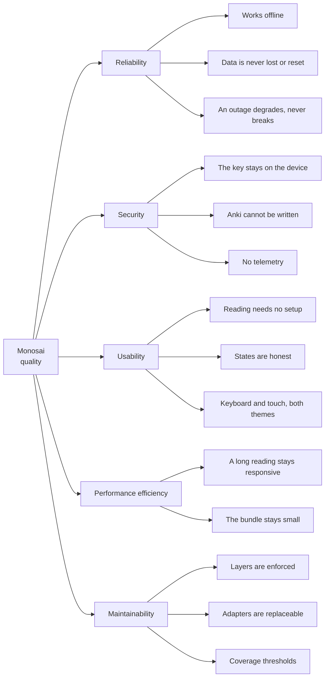

# 10. Quality Requirements

## 10.1 Quality requirements overview

The three top goals are in [section 1.2](01-introduction-and-goals.md#12-quality-goals). This tree
adds the qualities below them that still shape the code. Categories follow ISO 25010.

## 10.2 Quality scenarios

Each scenario names the gate that holds it. A gate that cannot be automated is listed in
[chapter 11](11-risks-and-technical-debt.md) instead of being claimed here.

| # | Quality | Scenario | Response and measure | Gate |
| --- | --- | --- | --- | --- |
| Q1 | Reliability, offline | The learner opens the installed application with the network off | The shell loads from Cache Storage, the library and a saved reading render, and the dictionary answers lookups. Only new AI requests and a live Anki connection report that a network is needed | `npm run e2e:pwa` against the production build, with the service worker live |
| Q2 | Reliability, data | A schema upgrade fails part way | The database is not deleted and not reset. Startup routes to the recovery screen with a copyable technical code, and the data is still on disk | Migration and integrity tests, run over fake IndexedDB with real Dexie transactions |
| Q3 | Reliability, degradation | The AI service rate-limits a request, or the device goes offline mid-run | The failure is a typed error with a distinct code. Retries follow the client's own backoff and then stop. Saved content stays usable | Retry-policy and error-mapping tests beside the client |
| Q4 | Security | Anything at all is logged, shown, or exported after a provider failure | No credential and no response body appears. Only a `domain/code` string and a redacted cause | Client and logger tests; the credential is read in one file only |
| Q5 | Security | An AnkiConnect request is made | The action is on the allowlist, and no allowlisted action writes | The allowlist and its adapter tests |
| Q6 | Usability, no spend | A reading that declares no aid layers is opened, and the application is launched with readings that do | Zero outbound requests in both cases: an undeclared layer is never produced, and a launch creates no work of its own | Browser journeys with a stubbed provider that fails the test on an unexpected call |
| Q7 | Usability, accessibility | Any screen is scanned | No axe violation. Token contrast passes. Focus stays visible, overlays return focus, and touch targets stay large enough | axe scans in the browser suite, plus a token-contrast unit check |
| Q8 | Performance | A very long text is imported and then opened | Analysis runs in batches off the main thread and reports progress. The reader mounts a bounded paragraph window, so opening reads a bounded amount of data | Reading-performance journeys, and a worker performance test |
| Q9 | Performance, size | A dependency or a lazy chunk grows | The initial bundle and the largest lazy chunk stay within the declared budgets | The bundle report check in the build stage, against [`bundle-budgets.json`](../../bundle-budgets.json), which owns the numbers |
| Q10 | Maintainability | A screen imports a Dexie repository directly | ESLint fails on the layer zone. The build does not depend on a reviewer noticing | `layerZones` in [`eslint.config.js`](../../eslint.config.js) |
| Q11 | Maintainability | Any change is merged | Coverage stays at or above the declared thresholds | `npm run test:coverage`, with the thresholds declared in the build configuration |
| Q12 | Maintainability | The deployed build differs from the tested build | It cannot. One stage produces the artifact, every other stage consumes it, and the deployment publishes that same artifact | The artifact verification and reuse described in [chapter 7](07-deployment-view.md) |

## 10.3 Running the gates

| Command | Covers |
| --- | --- |
| `npm run verify` | Exactly the blocking gates that CI runs: static analysis, coverage, and the production build with `verify-dist` |
| `npm test` | The Vitest suite |
| `npm run test:coverage` | The suite with the thresholds from Q11 |
| `npm run e2e` | The desktop and Android smoke lane. The default for ordinary work |
| `npm run e2e:full` | The full browser regression lane. Use it when shared end-to-end code changes |
| `npm run e2e:pwa` | The production build with the service worker live, which is Q1 |

When a gate is added to `npm run verify`, it is added to CI in the same change, and the other way
round.
